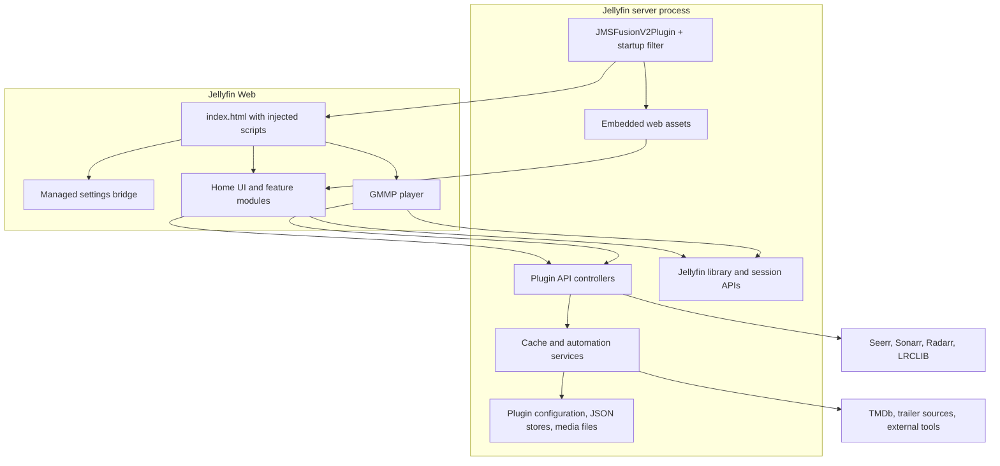
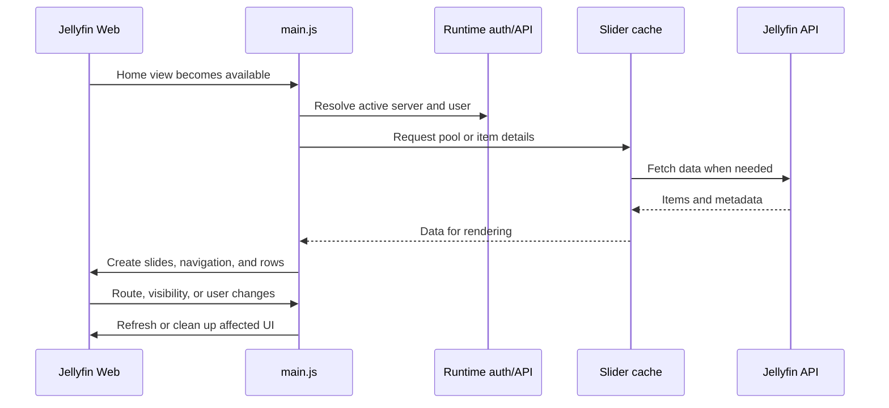

# How JMSFusionV2 works

This guide explains the implementation in this repository, from Jellyfin startup to browser rendering and persistent storage. It is a code walkthrough, not a guarantee of compatibility with a particular installed server. The project targets .NET 9 and references Jellyfin 10.11.0 packages; the README also identifies the project as archived.

The names **MonWUI**, **JMSFusionV2**, and **GMMP** appear throughout the code. MonWUI names the web experience, JMSFusionV2 is the Jellyfin plugin, and GMMP is its browser music player. Older names survive in routes, settings keys, and filenames.

## 1. The architecture

The plugin combines an ASP.NET Core backend running inside Jellyfin with JavaScript ES modules running inside Jellyfin Web. C# serves assets, exposes APIs, persists data, and runs server-side jobs. JavaScript obtains library data, changes the page DOM, and coordinates playback and UI features.



A native client that does not render this web interface does not execute these modules. The server APIs and jobs can exist independently, but the visual enhancements depend on Jellyfin Web loading the injected scripts.

## 2. What happens at server startup

Start with [JMSFusionPlugin.cs](../JMSFusionPlugin.cs) and [JMSFusionServiceRegistrator.cs](../JMSFusionServiceRegistrator.cs).

`JMSFusionV2Plugin` inherits from Jellyfin's `BasePlugin<JMSFusionV2Configuration>`. It supplies the plugin identity, loads configuration through the base class, exposes dashboard pages through `IHasWebPages`, and keeps a static `Instance` reference used by controllers and services.

The service registrator adds three singleton services:

- `TrailerAutomationService`: trailer discovery, downloading, NFO updates, and tool preparation.
- `CinemaPreRollCacheService`: cached data for the cinema pre-roll feature.
- `ScopedCacheJsonService`: persistent JSON caches for browser features.

It also registers `JMSStartupFilter` as an ASP.NET Core startup filter. This is the important connection to the HTTP request pipeline: [Hosting/JMSStartupFilter.cs](../Hosting/JMSStartupFilter.cs) inserts middleware before invoking Jellyfin's remaining application setup.

The filter starts background trailer-tool preparation, rewrites `/web/slider/...` requests to `/slider/...`, installs static asset handlers, and intercepts relevant index-page requests. Registering `UseJMSFusionV2()` is not what activates this behavior: the extension in [MiddlewareExtensions.cs](../MiddlewareExtensions.cs) currently returns the application unchanged.

### Injecting the browser entry points

For a successful HTML index response, the startup middleware captures the response body, inserts the snippet before `</head>` when possible, and caches the resulting HTML. The `SL-INJECT BEGIN` marker prevents inserting a second copy. Configuration changes invalidate the index cache.

`BuildScriptsHtml()` produces a bootstrap script plus three versioned module URLs:

```text
../slider/dist/storage-preload.js
../slider/dist/main.js
../slider/dist/player.js
```

The bootstrap and HTTP cache/version helpers live in [AssetVersioning.cs](../AssetVersioning.cs). The preload module initializes the settings bridge; the other entry points implement the main UI and music player. These are separate module scripts, so their order in the HTML should not be mistaken for a blanket guarantee that every asynchronous initialization task has completed before another module runs.

### Injection paths that can be confusing

The repository contains several approaches:

| Mechanism | Role in this checkout |
| --- | --- |
| Startup-filter middleware | Actively registered response interception and HTML injection |
| `ResponseTransformation` | The plugin registers an index transformation rule when enabled |
| `TransformingFileProvider` / `InMemoryRewriterFileProvider` | File-provider rewriting implementations; no construction/registration call sites were found in this checkout |
| `IndexPatcher` | Optional physical modification of Jellyfin's `index.html` |

The physical patch is disabled by default through `EnablePhysicalIndexHtmlPatchFallback`. Enabling it triggers patch attempts; disabling it after it was enabled triggers unpatching. Uninstalling also attempts to remove the physical patch. Read [IndexPatcher.cs](../IndexPatcher.cs) when investigating this mode rather than assuming an on-disk edit is part of every startup.

## 3. How assets reach the browser

The DLL embeds `Resources/`, `RuntimeModules/`, and `Web/`. A normal installation therefore carries its frontend assets inside the plugin assembly.

There are multiple asset-serving paths:

| URL | Implementation |
| --- | --- |
| `/slider/...` | Startup static-file middleware and [SliderAssetsController](../Controllers/SliderAssetsController.cs) |
| `/web/slider/...` | Rewritten to `/slider/...` by [PathRewriteMiddleware](../Core/PathRewriteMiddleware.cs) |
| `/Plugins/JMSFusionV2/runtime/{name}.js` | [JMSFusionRuntimeController](../Controllers/JMSFusionRuntimeController.cs), with an explicit map for `auth`, `api`, and `storage-preload` |
| `/Plugins/JMSFusionV2/assets/UiJs` and `/WebSettingsJs` | [JMSFusionAssetsController](../Controllers/JMSFusionAssetsController.cs), dashboard scripts |

**Asset precedence matters.** The startup filter registers embedded `/slider` assets first, then a physical `slider` directory under the detected web root if it exists. Separately, the controller checks `ScriptDirectory` before its embedded fallback. A request satisfied by the earlier static middleware never reaches that controller. Consequently, setting `ScriptDirectory` does not guarantee that it overrides an embedded asset at the same URL.

When debugging an edit that appears to have no effect, inspect the actual response in the browser Network panel. Check both its URL and contents, including whether the browser loaded a generated `dist` bundle rather than an individual source module.

## 4. Building and packaging

[JMSFusion.csproj](../JMSFusion.csproj) coordinates the C# and JavaScript build. [tools/minify-assets.mjs](../tools/minify-assets.mjs) performs two related tasks:

1. Copies asset trees into an intermediate directory and minifies individual JavaScript files using Terser.
2. Uses esbuild to bundle the three browser entry points, with ES-module code splitting and hashed shared chunks.

Its resolver maps the source modules' plugin runtime import paths back to files in `RuntimeModules/`. This lets the source retain its server-oriented imports while producing deployable bundles.

The project embeds generated bundles as well as the declared resource trees. Generated output belongs under `obj/`; edit the original modules and rebuild instead of editing generated chunks.

Typical commands from the repository root:

```sh
npm ci --ignore-scripts --no-audit --no-fund
npm run minify:assets
dotnet build JMSFusion.csproj --configuration Release
```

The .NET build also invokes the asset build and installs the pinned JavaScript dependencies if the required packages are missing. The resulting assembly is `bin/Release/net9.0/Jellyfin.Plugin.JMSFusionV2.dll`. The build runs [update_meta.sh](../update_meta.sh), which updates `meta.json`, including its timestamp and version metadata; this explains why a build can dirty that file.

## 5. Browser startup and the home screen

[Resources/slider/main.js](../Resources/slider/main.js) is the main coordinator. It imports authentication, configuration, language selection, cache helpers, slider rendering, and navigation, then coordinates feature startup.

Jellyfin Web behaves as a single-page application: navigating between views often changes the DOM without loading a new document. The plugin therefore listens to route/view events and uses `MutationObserver` to detect relevant DOM changes. Look for `robustBoot()`, `initializeSliderOnHome()`, the view lifecycle listeners, and their cleanup functions.

A simplified home-screen flow is:



The core rendering files divide responsibility:

| File | Responsibility |
| --- | --- |
| [slideCreator.js](../Resources/slider/modules/slideCreator.js) | Builds slide content and coordinates slide-specific resources |
| [navigation.js](../Resources/slider/modules/navigation.js) | Slide changes, navigation dots, swipe behavior, and layout interactions |
| [timer.js](../Resources/slider/modules/timer.js) / [progressBar.js](../Resources/slider/modules/progressBar.js) | Automatic advancement and visible progress |
| [sliderCache.js](../Resources/slider/modules/sliderCache.js) | Cached queries, item details, and user-data updates |
| [recentRows.js](../Resources/slider/modules/recentRows.js) | Recently added/played and related content rows |
| [personalRecommendations.js](../Resources/slider/modules/personalRecommendations.js) | Personalized and genre-based discovery |
| [directorRows.js](../Resources/slider/modules/directorRows.js) / [studioHubs.js](../Resources/slider/modules/studioHubs.js) | Director and studio collections |

Feature flags determine which portions initialize. Rendering is also deferred or scheduled around page readiness and idle time. When adding a feature, its lifecycle matters as much as its initial render: timers, listeners, observers, and image/video resources need cleanup when views or users change.

## 6. Configuration has several layers

There is no single settings object that owns every setting.

### Server configuration

[JMSFusionConfiguration.cs](../JMSFusionConfiguration.cs) defines the Jellyfin plugin configuration model. It includes asset paths, integration settings, trailer options, global frontend snapshots, watchlists, comments, studio entries, and parental PIN data. Controllers commonly change this object and call `UpdateConfiguration()` to persist it through Jellyfin.

`JMSFusionV2Plugin.UpdateConfiguration()` has a noteworthy compatibility behavior: for a different incoming configuration object, it preserves existing non-default property values when the incoming values equal defaults. This helps partial updates avoid dropping existing values, but is important to understand when implementing a reset or explicitly setting a property back to its default.

### Frontend settings and the storage bridge

[config.js](../Resources/slider/modules/config.js) assembles browser-facing configuration from defaults and stored values. [configPersistence.js](../Resources/slider/modules/configPersistence.js) writes browser settings, while [settingsPage.js](../Resources/slider/modules/settingsPage.js) and `modules/settings/` provide the editing UI.

[RuntimeModules/storagePreload.js](../RuntimeModules/storagePreload.js) installs `window.__JMS_MANAGED_STORAGE__`, patches local-storage access, loads a server snapshot, and debounces persistence. Its deny lists exclude credential/session fields from managed snapshots.

[UserSettingsController.cs](../Controllers/UserSettingsController.cs) exposes:

- `GET /Plugins/JMSFusionV2/UserSettings?profile=desktop`
- `POST /Plugins/JMSFusionV2/UserSettings/Publish`

Here, **profile means desktop or mobile**, not a Jellyfin account. The controller stores shared snapshots in `GlobalUserSettingsJsonDesktop` and `GlobalUserSettingsJsonMobile`, with separate revisions. It does not maintain a per-user settings dictionary. `ForceGlobalUserSettings` influences frontend editing behavior; do not infer account-specific persistence from the controller's name.

### Language selection

[language/index.js](../Resources/slider/language/index.js) selects language catalogs, with English available as a fallback. Modules commonly access a stable label key and provide a fallback string. For example:

```js
const caption = config.languageLabels?.details || "Details";
```

Some keys have Turkish names for historical reasons. Those keys are identifiers shared across catalogs and callers; translating a displayed fallback does not require renaming the key. Intentional Turkish catalogs and multilingual matching terms also serve a different purpose from hardcoded Turkish UI text.

## 7. Persistent data and caching

Separate authoritative data from data that can be rebuilt:

| Data | Storage and ownership |
| --- | --- |
| Jellyfin library, users, playback state | Jellyfin itself, accessed through its APIs/services |
| Plugin settings and several feature records | Jellyfin-managed plugin configuration |
| Desktop/mobile frontend snapshots | JSON strings and revisions inside plugin configuration |
| Discovery and music caches | Plugin-managed scoped JSON files |
| Seerr request history | Configuration plus the `seerr/requests.json` store |
| Local UI state and credentials | Browser storage, subject to each module's storage rules |
| Downloaded trailers, NFO changes, lyrics | Media-related filesystem paths used by the corresponding jobs |

`GetStorageDirectory()` in the plugin selects an available Jellyfin configuration/data directory, appends `JMSFusionV2`, and creates requested subdirectories. Avoid assuming one absolute filesystem path across platforms.

[scopedJsonCache.js](../Resources/slider/modules/scopedJsonCache.js) is the browser bridge to [ScopedCacheController.cs](../Controllers/ScopedCacheController.cs). The backend service accepts a fixed set of cache types: `recentRows`, `directorRows`, `personalRecommendations`, `collectionCache`, `sliderCache`, and `gmmpMusic`.

Files are stored under `scoped-cache/<cacheType>/<scope-hash>.json`. The service hashes the normalized scope, serializes access with per-file semaphores, and writes through temporary files followed by replacement. It also trims slider cache payloads and handles expiry/size-related rules. Hashing provides a deterministic filename; it is not an authorization decision.

Several filenames ending in `Db.js` still exist, but they now wrap scoped JSON storage and legacy IndexedDB cleanup/migration. Likewise, [player/utils/db.js](../Resources/slider/modules/player/utils/db.js) includes legacy music database migration. Do not assume the current cache is entirely browser IndexedDB just because a class or filename says “DB.”

## 8. Authentication and API boundaries

[RuntimeModules/auth.js](../RuntimeModules/auth.js) resolves and stores Jellyfin credential context. [RuntimeModules/api.js](../RuntimeModules/api.js) builds requests, waits for authentication readiness, handles errors/retries, invokes native playback, and coordinates user-data/cache changes when the active profile changes.

The browser makes two broad kinds of requests: normal Jellyfin requests for media and sessions, and plugin requests for features Jellyfin does not provide directly. External integration work is also performed by backend controllers using configured integration details.

Authorization is implemented unevenly across the controller surface. For example, the trailer run endpoint explicitly reads token/user headers and checks administrator status, while `UserSettingsController.Publish()` does not contain a corresponding administrator check in its action. A disabled frontend control and a validated server-side permission are different mechanisms. When extending an endpoint, inspect its actual checks and the host's authentication setup rather than assuming a shared authorization policy covers every plugin route.

## 9. Feature flows worth tracing

### Trailer automation

[TrailersController.cs](../Controllers/TrailersController.cs) exposes `/JMSFusionV2/trailers/run`, `/status`, `/cancel`, and `/diag`. It coordinates a background job, captures progress/log output, and supports cancellation.

[TrailerAutomationService.cs](../Core/TrailerAutomationService.cs) implements the work in C#: it retrieves items, discovers trailer candidates, invokes downloader tools, validates results, applies the overwrite policy, and optionally prepares `backdrops/theme.mp4`. The URL/NFO mode writes trailer references into NFO files and requests metadata refreshes.

Despite historical `trailers.sh` and `trailersurl.sh` wording in settings, the active controller delegates steps to this C# service. Tool preparation manages yt-dlp and Deno and can prepare FFmpeg-related tools. Execution still depends on filesystem access and the available tools.

The browser [trailersPage.js](../Resources/slider/modules/settings/trailersPage.js) polls the job and parses some textual log summaries. This is a real producer/consumer coupling: changing a server log phrase can affect progress display or localization unless the corresponding parser is updated.

### Music playback and lyrics

The music entry point is [player/main.js](../Resources/slider/modules/player/main.js). Its subdirectories separate state/authentication/playlists (`core`), playback and progress (`player`), controls and dialogs (`ui`), lyrics, and utilities.

GMMP uses a browser audio element and Jellyfin media data, reports playback activity, and integrates with browser Media Session controls. [GmmpSyncController.cs](../Controllers/GmmpSyncController.cs) provides state and command endpoints for coordinating GMMP clients; [CastController.cs](../Controllers/CastController.cs) exposes session visibility and access/settings behavior.

The separate [LyricsController.cs](../Controllers/LyricsController.cs) runs a server-side library job, searches LRCLIB, and writes lyrics files. This is distinct from displaying or reading lyrics in the browser player.

### Seerr and Arr requests

The UI is under [modules/seerr/](../Resources/slider/modules/seerr/). Search and item-page bridges attach request controls to Jellyfin views. [SerrController.cs](../Controllers/SerrController.cs) handles search, metadata, requests, approvals, and request history. [ArrController.cs](../Controllers/ArrController.cs) handles Sonarr/Radarr settings, options, calendars, and direct episode/movie requests.

These routes retain the `/MonWUI/seerr`, `/MonWUI/serr`, and `/MonWUI/arr` naming, with `/Plugins/MonWUI/...` aliases. Request history is also persisted by [SerrRequestStore.cs](../Core/SerrRequestStore.cs), which merges and bounds stored records and replaces its JSON file through a temporary file.

The existing [Seerr & Arr integration guide](seerr-arr-integration.md) covers the user-facing workflow and screenshots.

### Details, pause screens, PINs, and shared collections

[detailsModal.js](../Resources/slider/modules/detailsModal.js), [hoverTrailerModal.js](../Resources/slider/modules/hoverTrailerModal.js), [pauseModul.js](../Resources/slider/modules/pauseModul.js), and [subtitleCustomizer.js](../Resources/slider/modules/subtitleCustomizer.js) extend playback and detail views in the browser.

Backend controllers support parental PIN settings/verification, watchlists and sharing, comments, and studio collection records/uploads. These features cross the browser/server boundary: a rendered modal may combine Jellyfin metadata, plugin-owned records, and settings from browser storage.

## 10. A practical code-reading and debugging route

For a first pass, read these in order:

1. `JMSFusion.csproj`: what gets built and embedded.
2. `JMSFusionServiceRegistrator.cs` → `Hosting/JMSStartupFilter.cs`: how execution enters the server request pipeline.
3. `JMSFusionPlugin.BuildScriptsHtml()`: what the browser is instructed to load.
4. `RuntimeModules/storagePreload.js` → `modules/config.js`: how frontend settings become available.
5. `main.js` → `slideCreator.js` → `navigation.js`: how a visible home-screen feature is assembled.
6. One complete feature pair, such as `settings/trailersPage.js` → `TrailersController.cs` → `TrailerAutomationService.cs`.

For troubleshooting, follow the failing boundary:

| Symptom | First checks |
| --- | --- |
| No plugin UI | Index response contains `SL-INJECT BEGIN`; the three `dist` modules load; browser console has no boot error |
| Source edits do not appear | Rebuild embedded bundles; inspect response contents and asset/cache headers; check middleware precedence |
| UI appears only after navigating twice | Home-view readiness, route listeners, duplicate initialization guards, and cleanup |
| Settings revert or affect another device | Desktop/mobile snapshot selection, managed storage state, publish requests, and global revisions |
| Stale recommendations or music data | Active user/server scope, scoped-cache requests, and invalidation behavior |
| Trailer job runs but counters are wrong | Raw server log output compared with `parseDownloaderSummary()` / `parseUrlNfoSummary()` |
| Request button behaves unexpectedly | Browser request payload, the specific controller's access checks, and external-service response |

The diagnostic routes `/Plugins/JMSFusionV2/Status`, `/Snippet`, and `/Env`, plus `/JMSFusionV2/ping`, help distinguish plugin loading and injection problems from frontend feature problems. The main home code also has `jms:debug:home-sections` and `jms:trace:home-sections` storage flags for more focused logging.
